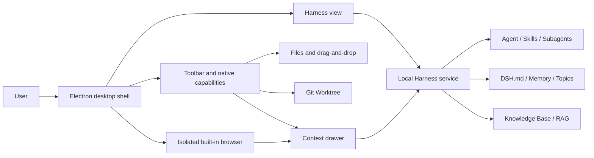

# DSH App

> A cross-platform local AI workspace powered by DeepSeek Harness, bringing conversations, skills, knowledge bases, persistent memory, subagents, web context, and Git isolation to the desktop.

**English** | [简体中文](README.zh.md)


DSH App uses [DeepSeek Harness](https://github.com/deepseek-ai/deepseek-harness) as its local AI core and adds a native desktop window, system file access, a global shortcut, a built-in browser, and Git Worktree management through Electron. The client starts the Harness service on `127.0.0.1` and stops it when the desktop application exits.

You can use this project as a personal local AI client or as the foundation for specialized desktop products such as bid-response authoring, research writing, and video-production tools.

> [!IMPORTANT]
> The current release targets developers and internal testing. This repository does not commit a prebuilt Harness runtime or installers. You need a built DeepSeek Harness source checkout before the first run.

## Features

### Unified desktop workspace

- Use Harness workspaces, conversations, skills, knowledge bases, and agents in one window.
- Switch between Chat and Work modes without reloading the active conversation.
- Bring the window to the foreground from any application with `CommandOrControl+Shift+D`.
- Add local files to the active conversation through a file picker or drag and drop.
- Open the built-in browser beside the conversation and capture selected text or visible page content as context.
- Inspect visible context sources, including `DSH.md`, memory, topics, skills, knowledge bases, files, web pages, and Worktrees.

### Knowledge, memory, and skills

- `~/.dsh/DSH.md` stores global working rules and is loaded with priority for each session.
- `~/.dsh/memory.md` stores short, reusable lessons.
- Memory larger than 8 KiB can be split by topic into `~/.dsh/topics/*.md` and loaded only when relevant.
- Explicit “remember ...” requests are persisted before the answer; one-line lessons become memory, while multi-step procedures become Skills.
- Skills are loaded on demand instead of injecting every skill body into every conversation.
- Both ordinary directories and Obsidian Vaults can serve as knowledge bases.
- PDF, DOCX, Markdown, and text files can be scanned recursively, converted to Markdown, and indexed for local RAG retrieval.

Directory imports currently allow files up to 20 MB, up to 1,000 supported documents, and 100 MB in total. Importing the same directory again synchronizes added, changed, and removed files.

### Agents and development workflows

- Preserve the Harness Standard, PTC, and Creative modes.
- Create foreground or background subagents, inspect their hierarchy, resume or stop them, and collect their results.
- Create an isolated branch and Git Worktree from the selected repository's current `HEAD`.
- Store Worktrees under `~/.dsh/worktrees` and refuse normal removal when uncommitted changes remain.
- Reuse the bundled Harness desktop scaffold and plugin-development skills to build domain-specific clients.

## Architecture



DSH Desktop has three user-interface security boundaries:

1. **Desktop shell**: loads local HTML, CSS, and JavaScript for the toolbar, status panels, and native actions.
2. **Harness view**: loads only the exact loopback origin announced during startup and hosts the primary conversation interface.
3. **Built-in browser**: uses a separate persistent partition, allows only HTTP(S), and has no Node.js access.

The Electron main process owns application lifecycle, validated IPC, view layout, the Harness child process, file selection, and Git operations. Captured web content is labeled as untrusted reference data and cannot override the user request or `DSH.md`.

See the following documents for the full contract and implementation design:

- [Requirements](docs/requirements.md) (Chinese)
- [Technical design](docs/design.md) (Chinese)

## Relationship to DeepSeek Harness

This repository maintains the Electron shell, desktop-context extensions, runtime assembly scripts, and tests. It does not copy the full Harness source tree. During development, `scripts/prepare-runtime.js` builds a distributable runtime from a separate Harness source checkout.

The current development version is based on DeepSeek Harness `dsh-v0.1.1-rc.2` and expects the skills, memory, and directory knowledge-base extensions required by DSH Desktop. If those extensions have not been merged upstream, build the runtime from the corresponding Harness branch or commits. A plain upstream checkout may start successfully while leaving some extended features unavailable.

Runtime assembly copies the Harness `LICENSE`, `THIRD_PARTY_NOTICES.md`, and the Node.js license so binary distributions retain the required notices.

## Requirements

### Common dependencies

- Node.js 24 or later
- npm
- pnpm for installing and building DeepSeek Harness
- Git for source control and Worktree features
- A successfully built DeepSeek Harness source checkout

### Platform status

| Platform | Development | Current distribution path |
| --- | --- | --- |
| macOS Apple Silicon | Supported | DMG, ZIP, and unpacked application |
| Windows x64 | Supported | NSIS installer |
| Linux x64 | Source development supported | AppImage and DEB are configured in Electron Builder and should be built on a Linux host |

Public macOS distribution requires a Developer ID certificate and Apple notarization credentials. Unsigned or ad-hoc-signed applications are suitable only for testing on trusted machines.

## Run from source

### 1. Prepare DeepSeek Harness

```bash
git clone https://github.com/deepseek-ai/deepseek-harness.git
cd deepseek-harness
pnpm install
pnpm run build
```

If DSH Desktop's required extensions are not yet available upstream, switch to the branch that contains them before building.

### 2. Install desktop dependencies

After cloning this repository, enter its directory and run:

```bash
npm install
```

### 3. Assemble the embedded runtime

On macOS or Linux:

```bash
DSH_SOURCE=/absolute/path/to/deepseek-harness npm run runtime:prepare
```

On Windows PowerShell:

```powershell
$env:DSH_SOURCE = "C:\path\to\deepseek-harness"
npm run runtime:prepare
```

The generated runtime is written to `runtime/`. It is machine-generated, ignored by Git, and should not be committed.

### 4. Start the desktop client

```bash
npm start
```

The application creates `~/.dsh` on first launch and never overwrites existing user rules or memories.

## Commands

| Command | Purpose |
| --- | --- |
| `npm start` | Start the Electron client from source |
| `npm test` | Run desktop-layer automated tests |
| `npm run runtime:prepare` | Assemble a runtime for the current platform from Harness source |
| `npm run runtime:prepare:win` | Assemble a Windows x64 runtime |
| `npm run smoke` | Verify that the bundled Node.js runtime starts Harness and releases its port |
| `npm run pack` | Build an unpacked macOS Apple Silicon application |
| `npm run dist` | Build signed and notarized macOS DMG and ZIP artifacts |
| `npm run dist:mac:local` | Build an ad-hoc-signed macOS package for internal testing |
| `npm run dist:win` | Build a Windows x64 NSIS installer |

Packaging is intentionally separate from routine development and should run only when release artifacts are explicitly required.

## User data

DSH Desktop stores persistent data under `~/.dsh`:

| Path | Purpose |
| --- | --- |
| `~/.dsh/DSH.md` | Global working rules and session guidance |
| `~/.dsh/memory.md` | Concise long-term memory |
| `~/.dsh/topics/` | Topic-specific long-term memory |
| `~/.dsh/skills/` | User-created and installed skills |
| `~/.dsh/knowledge-bases/` | Local knowledge-base data managed by Harness |
| `~/.dsh/workspaces/` | Default workspaces |
| `~/.dsh/worktrees/` | Isolated Git Worktrees |
| `~/.dsh/desktop-settings.json` | Desktop mode and settings |
| `~/.dsh/desktop-context.json` | Active file, browser, and Worktree context |

Uninstalling the application does not automatically remove `~/.dsh`. Back up memories, skills, and knowledge bases before deleting this directory.

## Project structure

```text
DSH Desktop/
├── build/                    # Platform entitlements and signing configuration
├── docs/                     # Requirements and technical design
├── scripts/                  # Runtime assembly, patches, smoke tests, and release helpers
├── skills/                   # Harness desktop and plugin development skills
├── src/
│   ├── main.js               # Electron lifecycle, views, and IPC orchestration
│   ├── backend.js            # Harness child-process management
│   ├── desktop-state.js      # Desktop settings and context sources
│   ├── git-isolation.js      # Git Worktree creation and safe cleanup
│   ├── runtime-*.js          # Conversation context and persistent-learning extensions
│   ├── *-preload.cjs         # Restricted bridges for isolated views
│   └── shell.*               # Desktop toolbar and drawer UI
├── test/                     # Node.js automated tests
├── electron-builder.*.cjs   # macOS and Windows build configurations
└── package.json
```

Generated directories are excluded from Git: `node_modules/`, `runtime/`, `runtime-win32-x64/`, `release/`, and `artifacts/`.

## Testing

```bash
npm test
```

The current suite covers:

- Harness startup, readiness-origin validation, early exit, and timeout behavior
- Desktop mode and bounded context persistence
- File, browser, and Worktree context injection
- Git Worktree creation, parsing, and safe removal
- Idempotent desktop runtime patching
- Explicit remember directives, lesson deduplication, secret redaction, and Skill creation
- 8 KiB memory splitting and topic-aware recall
- `~/.dsh` initialization and legacy-data migration

Before publishing an installer, also run `npm run smoke` and launch the unpacked application on the target platform.

## Security and privacy

- The Harness service listens only on `127.0.0.1` and requests an available random port.
- The Harness view remains on the exact origin confirmed during startup.
- The desktop shell, Harness view, and browser use context isolation and disable page-level Node.js integration.
- The browser rejects non-HTTP(S) protocols such as `file:`, `javascript:`, and `data:`.
- Browser permissions are denied by default, and content is captured only after an explicit user action.
- The desktop shell records only user-selected local file paths and does not upload files by itself.
- IPC validates its sender, and Git commands use argument arrays rather than interpolated shell text.
- Common secret formats are redacted before reusable lessons are written.

Do not commit `.env` files, API keys, account credentials, `~/.dsh` data, or private knowledge bases. Report security issues privately to the maintainers instead of opening a public issue with exploit details.

## Derived applications and plugin development

This repository includes three reusable skills:

- `harness-desktop-app-builder`: scaffold domain applications with an independent brand, application ID, user home, and browser partitions.
- `harness-plugin-developer`: build Harness Client, Host, RPC, persistence, and Agent-lifecycle plugins.
- `dsh-desktop-build-verification`: build and verify installers only when release artifacts are explicitly requested.

Install or refresh these skills with:

```bash
python3 scripts/install-development-skills.py
```

The installer targets `~/.codex/skills` and `~/.dsh/skills`. The scaffold does not install dependencies, initialize Git, or build installers by default.

## Runtime Screenshot
### Main UI


### Skill Manager


### Knowledge Base


#### Connecting Obsidian


## Contributing

Issues, design discussions, and pull requests are welcome. A typical contribution should follow this process:

1. Describe the problem, user scenario, and expected behavior in an issue.
2. Develop on a focused branch with a clearly bounded change.
3. Update `docs/requirements.md` and `docs/design.md` when user behavior or architecture changes.
4. Add tests for important boundaries, state transitions, and failure handling.
5. Run `npm test`; run smoke and packaging checks only when the runtime or release path changes.
6. Do not commit runtimes, installers, personal data, credentials, or unrelated generated files.

Keep native desktop capabilities in the Electron project. Prefer Harness plugins for reusable conversation, knowledge-base, skill, and agent behavior.

## Troubleshooting

### “Embedded runtime is missing”

Confirm that the Harness checkout has completed `pnpm install` and `pnpm run build`, then rerun `npm run runtime:prepare` with the correct `DSH_SOURCE`.

### The client remains on the startup screen

Open the log directory from the application menu and inspect the Harness startup error. You can also run `npm run smoke` to validate the embedded service.

### macOS says the application is damaged

This usually indicates that the package was not signed with Developer ID and notarized by Apple. Public distribution should use `npm run dist` with signing and notarization credentials. Ad-hoc builds should remain limited to trusted test machines.

### Does an end user need to install DSH separately?

Source development requires a Harness checkout. A correctly assembled installer already contains Harness and Node.js, so end users do not need a separate DSH installation.

## Roadmap

- Complete native Linux build and verification workflows
- Add automated CI, cross-platform testing, and reproducible releases
- Publish the required Harness extensions as a traceable upstream branch or patch set
- Improve observability for knowledge-base synchronization, model calls, and subagent tasks
- Add product screenshots and demonstrations suitable for a public project page

## License

DSH Desktop is available under the [MIT License](LICENSE). DeepSeek Harness and other third-party components retain their respective licenses and copyright notices.

## Acknowledgements

- [DeepSeek Harness](https://github.com/deepseek-ai/deepseek-harness), the local agent and plugin core used by this project.
- [Electron](https://www.electronjs.org/), the cross-platform desktop runtime.
- Everyone who contributes code, tests, design work, and feedback to DSH Desktop.
