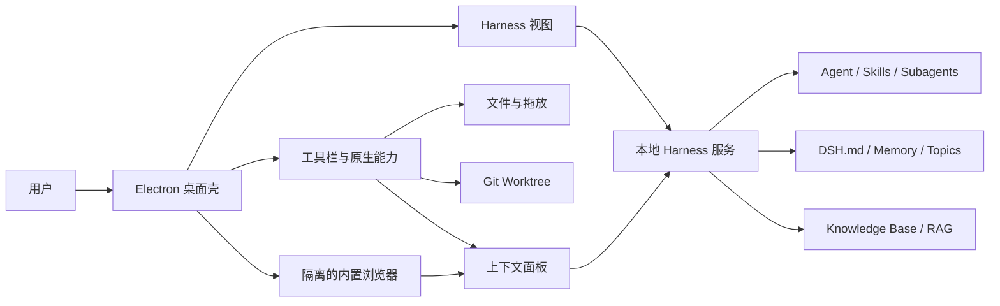
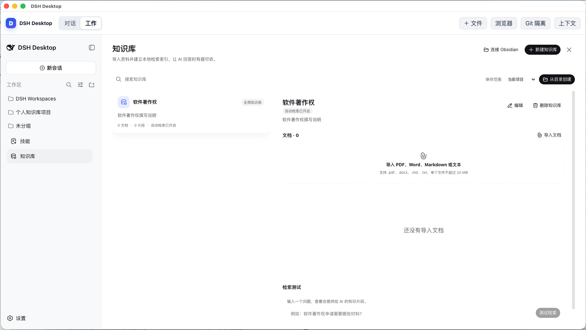

# DSH App

> 基于 DeepSeek Harness 的跨平台本地 AI 工作台，把会话、技能、知识库、长期记忆、子智能体、网页上下文和 Git 隔离带到桌面端。

[English](README.md) | **简体中文**


DSH App 将 [DeepSeek Harness](https://github.com/deepseek-ai/deepseek-harness) 作为本地 AI 内核，通过 Electron 提供原生桌面窗口、系统文件访问、全局快捷键、内置浏览器和 Git Worktree 管理。Harness 服务由客户端启动，只监听 `127.0.0.1`，关闭桌面窗口时一并停止。

项目适合两类使用方式：直接作为个人本地 AI 客户端使用，或者作为行业桌面应用的基础框架，继续开发标书应答、研究写作、视频制作等专用产品。

> [!IMPORTANT]
> 当前版本面向开发者和内部测试。仓库不提交预编译 Harness 运行时，也不提交安装包。首次运行前需要准备一份已经完成构建的 DeepSeek Harness 源码。

## 功能概览

### 统一桌面工作台

- 在同一个窗口中使用 Harness 的工作区、会话、技能、知识库和智能体能力。
- “对话”和“工作”两种模式可随时切换，切换过程不会刷新当前会话。
- 使用 `CommandOrControl+Shift+D` 从其他应用快速呼出窗口。
- 文件选择和拖放会把本地文件加入当前会话上下文。
- 内置浏览器与会话分栏显示，可将选中文本或当前网页正文加入上下文。
- 上下文面板展示 `DSH.md`、记忆、话题、技能、知识库、文件、网页和 Worktree 来源。

### 知识、记忆与技能

- `~/.dsh/DSH.md` 保存全局工作规则，每次会话优先读取。
- `~/.dsh/memory.md` 保存简短、可复用的经验。
- 当记忆超过 8 KiB 时，内容可按话题拆分到 `~/.dsh/topics/*.md`，并按会话主题加载。
- “记住……”指令会在回答前持久化；一句话经验写入记忆，多步骤流程沉淀为 Skill。
- 技能按需加载，避免在每次对话中注入全部技能正文。
- 支持普通目录和 Obsidian Vault 知识库。
- 可递归扫描 PDF、DOCX、Markdown 和文本文件，转换为 Markdown 后建立本地 RAG 索引。

目录知识库默认限制为单文件 20 MB、最多 1,000 份文档、目录总量 100 MB。再次导入同一目录会同步新增、修改和删除的文件。

### 智能体与开发工作流

- 保留 Harness 的标准、PTC 和创造模式。
- 支持创建前台或后台子智能体、查看层级、继续、停止及回传结果。
- 根据当前 Git 仓库的 `HEAD` 创建独立分支和 Worktree。
- Worktree 统一保存在 `~/.dsh/worktrees`，有未提交修改时拒绝普通删除。
- 内置 Harness 桌面应用脚手架和插件开发技能，可复用当前架构创建行业客户端。

## 架构



DSH App 由三个安全边界清晰的界面组成：

1. **桌面壳**：加载本地 HTML、CSS 和 JavaScript，负责工具栏、状态面板和原生操作入口。
2. **Harness 视图**：只加载启动时获得的精确回环地址，承载主要会话界面。
3. **内置浏览器**：使用独立持久分区，只允许 HTTP(S)，不具备 Node.js 权限。

Electron 主进程负责生命周期、IPC 校验、视图布局、Harness 子进程、文件选择和 Git 操作。网页正文被标记为不可信参考内容，不能覆盖用户指令或 `DSH.md`。

更详细的范围和实现依据见：

- [需求说明](docs/requirements.md)
- [技术设计](docs/design.md)

## 与 DeepSeek Harness 的关系

本仓库维护 Electron 桌面壳、桌面上下文扩展、运行时组装脚本和测试，不复制完整 Harness 源码。构建时，`scripts/prepare-runtime.js` 从单独的 Harness 源码目录生成可随应用分发的运行环境。

当前开发版本使用 DeepSeek Harness `dsh-v0.1.1-rc.2` 作为基础，并需要包含 DSH Desktop 所需的技能、记忆和目录知识库扩展。若这些扩展尚未合并到上游，请使用对应的 Harness 分支或提交构建运行时。单独使用上游基础版本时，桌面窗口可以启动，但部分扩展功能可能不可用。

运行时生成时会复制 Harness 的 `LICENSE`、`THIRD_PARTY_NOTICES.md` 和 Node.js 许可证，满足二进制分发时的许可证保留要求。

## 系统要求

### 通用依赖

- Node.js 24 或更高版本
- npm
- pnpm，用于安装和构建 DeepSeek Harness
- Git，用于源码管理和 Worktree 功能
- 一份已经构建完成的 DeepSeek Harness 源码

### 平台说明

| 平台 | 开发运行 | 当前发布方式 |
| --- | --- | --- |
| macOS Apple Silicon | 支持 | DMG、ZIP、目录应用 |
| Windows x64 | 支持 | NSIS 安装程序 |
| Linux x64 | 支持源码运行 | Electron Builder 配置了 AppImage 和 DEB，建议在 Linux 主机上构建 |

macOS 正式发布需要 Developer ID 证书和 Apple 公证凭据。未签名或临时签名的应用只适合可信设备内部测试。

## 从源码运行

### 1. 准备 DeepSeek Harness

```bash
git clone https://github.com/deepseek-ai/deepseek-harness.git
cd deepseek-harness
pnpm install
pnpm run build
```

如果 DSH App 依赖的扩展尚未进入上游，请在执行构建前切换到包含这些扩展的分支。

### 2. 安装桌面工程依赖

克隆本仓库后进入项目目录：

```bash
npm install
```

### 3. 生成内置运行环境

macOS 或 Linux：

```bash
DSH_SOURCE=/absolute/path/to/deepseek-harness npm run runtime:prepare
```

Windows PowerShell：

```powershell
$env:DSH_SOURCE = "C:\path\to\deepseek-harness"
npm run runtime:prepare
```

生成内容位于 `runtime/`。这是本机产物，已经加入 `.gitignore`，不应提交到仓库。

### 4. 启动桌面客户端

```bash
npm start
```

应用首次启动时会创建 `~/.dsh`，不会覆盖已经存在的用户规则或记忆。

## 常用命令

| 命令 | 用途 |
| --- | --- |
| `npm start` | 从源码启动 Electron 客户端 |
| `npm test` | 运行桌面层自动化测试 |
| `npm run runtime:prepare` | 从 Harness 源码生成当前平台运行时 |
| `npm run runtime:prepare:win` | 生成 Windows x64 运行时 |
| `npm run smoke` | 验证内置 Node 和 Harness 服务可启动并释放端口 |
| `npm run pack` | 生成 macOS Apple Silicon 目录应用 |
| `npm run dist` | 生成签名并公证的 macOS DMG 和 ZIP |
| `npm run dist:mac:local` | 生成用于内部测试的 macOS 临时签名安装包 |
| `npm run dist:win` | 生成 Windows x64 NSIS 安装程序 |

构建命令不会在日常开发中自动执行。只有明确需要发布物时才应生成安装包。

## 用户数据

DSH App 将所有持久化数据放在用户目录下的 `~/.dsh`：

| 路径 | 作用 |
| --- | --- |
| `~/.dsh/DSH.md` | 全局工作规则和会话指导 |
| `~/.dsh/memory.md` | 简短的长期记忆 |
| `~/.dsh/topics/` | 按话题拆分的长期记忆 |
| `~/.dsh/skills/` | 用户创建或安装的技能 |
| `~/.dsh/knowledge-bases/` | 本地知识库数据，具体结构由 Harness 管理 |
| `~/.dsh/workspaces/` | 默认工作区 |
| `~/.dsh/worktrees/` | Git 隔离工作区 |
| `~/.dsh/desktop-settings.json` | 模式和桌面设置 |
| `~/.dsh/desktop-context.json` | 当前文件、网页和 Worktree 上下文 |

卸载应用不会自动删除 `~/.dsh`。请在清理前备份需要保留的记忆、技能和知识库。

## 项目结构

```text
DSH Desktop/
├── build/                    # 平台权限和签名配置
├── docs/                     # 需求与技术设计
├── scripts/                  # 运行时准备、补丁、冒烟测试和发布辅助脚本
├── skills/                   # Harness 桌面开发与插件开发技能
├── src/
│   ├── main.js               # Electron 生命周期、视图和 IPC 编排
│   ├── backend.js            # Harness 子进程管理
│   ├── desktop-state.js      # 桌面设置和上下文来源
│   ├── git-isolation.js      # Git Worktree 创建与安全清理
│   ├── runtime-*.js          # 会话上下文和持续学习扩展
│   ├── *-preload.cjs         # 隔离视图的受限安全桥
│   └── shell.*               # 桌面工具栏与面板界面
├── test/                     # Node.js 自动化测试
├── electron-builder.*.cjs   # macOS 和 Windows 构建配置
└── package.json
```

以下目录均为生成物，不进入 Git：`node_modules/`、`runtime/`、`runtime-win32-x64/`、`release/` 和 `artifacts/`。

## 测试

```bash
npm test
```

当前测试覆盖：

- Harness 启动、就绪地址校验、异常退出和超时处理
- 模式和上下文状态持久化
- 文件、网页和 Worktree 上下文注入
- Git Worktree 的创建、解析和安全删除
- 桌面运行时补丁的幂等性
- 明确“记住”指令、经验去重、密钥脱敏和技能创建
- 8 KiB 记忆拆分与话题按需加载
- `~/.dsh` 初始化和旧数据迁移

发布前还应运行 `npm run smoke`，并实际启动对应平台的目录应用。

## 安全与隐私

- Harness 服务只监听 `127.0.0.1`，使用随机可用端口。
- Harness 页面只允许停留在启动时确认的同一 Origin。
- 桌面壳、Harness 和浏览器均启用上下文隔离并禁用页面 Node.js 权限。
- 内置浏览器拒绝 `file:`、`javascript:` 和 `data:` 等非 HTTP(S) 协议。
- 浏览器默认拒绝权限请求，只有用户主动操作才会采集网页正文。
- 文件只记录用户选择的本地路径，不会由桌面壳自动上传。
- IPC 校验调用方，Git 命令使用参数数组，不执行拼接后的 Shell 文本。
- 常见密钥格式在写入长期经验前进行脱敏。

请勿提交 `.env`、API Key、账号凭据、`~/.dsh` 数据或私人知识库。发现安全问题时，请通过私密渠道联系维护者，不要先公开包含利用细节的 Issue。

## 派生应用与插件开发

仓库包含三个可复用技能：

- `harness-desktop-app-builder`：创建独立品牌、应用 ID、用户目录和浏览器分区的行业桌面项目。
- `harness-plugin-developer`：开发 Harness Client、Host、RPC、持久化和 Agent 生命周期插件。
- `dsh-desktop-build-verification`：仅在明确要求时构建并验证安装包。

安装或更新这些技能：

```bash
python3 scripts/install-development-skills.py
```

安装目标为 `~/.codex/skills` 和 `~/.dsh/skills`。脚手架默认不会安装依赖、初始化 Git 或生成安装包。

## 运行时界面展示
### 主界面


### 技能管理


### 知识库



#### 连接 Obsidian


## 贡献指南

欢迎提交 Issue、设计讨论和 Pull Request。建议遵循以下流程：

1. 在 Issue 中说明问题、使用场景和期望行为。
2. 从独立分支开始开发，并保持改动范围清晰。
3. 涉及用户行为或架构时，同步更新 `docs/requirements.md` 和 `docs/design.md`。
4. 为关键边界、状态迁移和错误处理补充测试。
5. 运行 `npm test`；涉及运行时或发布时再运行冒烟测试。
6. 不提交运行时、安装包、个人数据、密钥或无关生成文件。

桌面原生能力应留在 Electron 工程；可复用的会话、知识库、技能和智能体能力应优先在 Harness 插件层实现。

## 常见问题

### 提示“缺少内置运行环境”

确认 Harness 已执行 `pnpm install` 和 `pnpm run build`，然后使用正确的 `DSH_SOURCE` 重新运行 `npm run runtime:prepare`。

### 客户端打开后一直停留在启动界面

使用应用菜单打开日志目录，检查 Harness 是否输出了启动错误。还可以运行 `npm run smoke` 验证内置服务。

### 是否需要另外安装 DSH

从源码运行需要准备 Harness 源码。正确生成并打包后的安装程序已经包含 Harness 与 Node.js 运行环境，最终用户不需要另外安装 DSH。

## 路线图

- 完善 Linux 原生构建和验证流程
- 增加自动化 CI、跨平台测试与可复现发布
- 将桌面所需的 Harness 扩展整理为可追踪的上游分支或补丁集
- 为知识库同步、模型调用和子智能体任务增加更完整的可观测性
- 增加适合公开项目主页的产品截图和演示资料

## 许可证

DSH App 采用 [MIT License](LICENSE)。DeepSeek Harness 及其他第三方组件保留各自的许可证和版权声明。
这是我的第一个开源项目，所以采用了MIT License。因为它限制很少，大家基本可以自由使用本软件，包括商业用途。
### 下面是 MIT License允许做的事情：
- 免费或收费使用
- 复制和传播
- 修改源代码
- 发布二次开发版本
- 合并到自己的项目
- 闭源销售
- 更换产品名称和界面
- 将项目作为商业软件的一部分
- 对软件进行再许可
### 下面是您不能做的事情：
- 删除作者的版权及许可证声明后，把原始代码完全声称为自己创作。
- 要求作者为软件故障、数据损失或适销性承担保证责任；MIT 明确规定软件按原样提供，不附带保证。
- 自动取得作者的商标、Logo、域名等权利。MIT 主要许可软件著作权，并没有授予品牌使用权。
- 忽略项目中第三方依赖的许可证；每项依赖仍受自己的许可证约束。
## 致谢

- [DeepSeek Harness](https://github.com/deepseek-ai/deepseek-harness)：本项目使用的本地智能体与插件内核。
- [Electron](https://www.electronjs.org/)：跨平台桌面运行框架。
- 所有为 DSH App 提交代码、测试、设计和反馈的贡献者。
