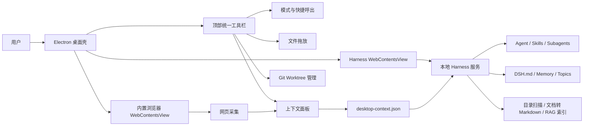
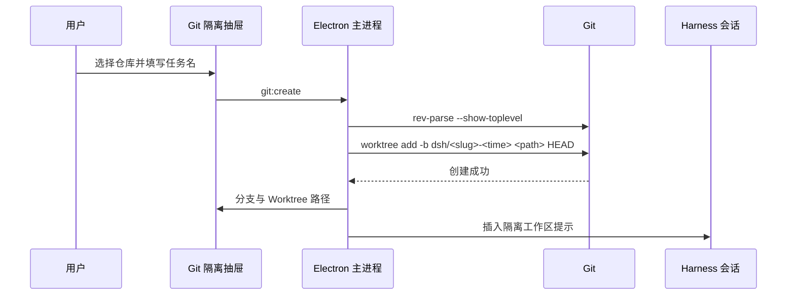
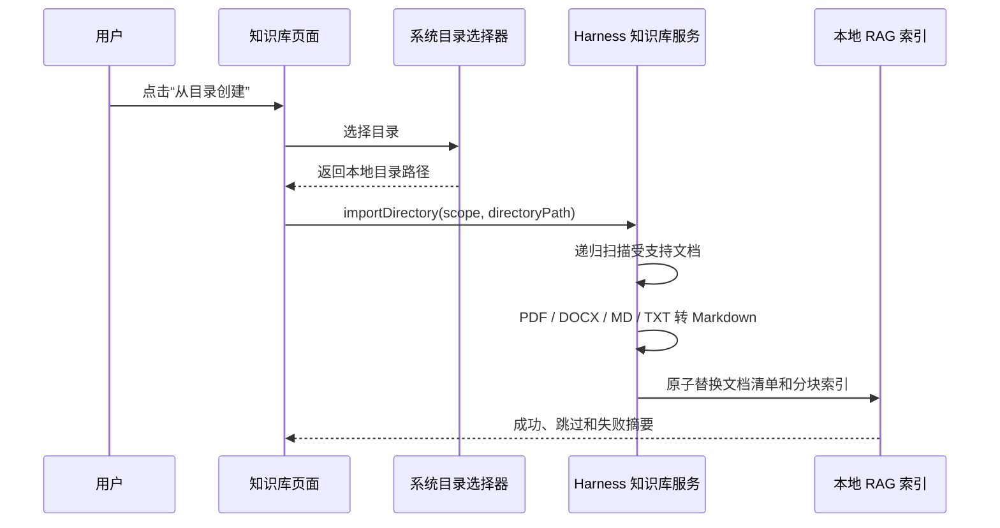

# DSH Desktop 统一智能工作台设计

## 1. 总体结构



## 2. 进程职责

### Electron 主进程

- 管理主窗口、全局快捷键、菜单和生命周期。
- 启动并停止内置 Harness 服务。
- 创建两个隔离视图：Harness 视图和按需创建的浏览器视图。
- 计算视图布局，保证浏览器和右侧面板不会覆盖顶部工具栏。
- 提供经过发送者校验的 IPC：模式、上下文、浏览器、文件和 Git Worktree。

### 桌面壳渲染进程

- 仅加载本地 `shell.html`、CSS 和脚本。
- 渲染顶部工具栏、启动状态、上下文抽屉和 Git 抽屉。
- 处理拖放视觉反馈，通过 preload 获取本地文件路径。
- 不直接访问 Node.js、文件系统或 Git。

### Harness 视图

- 加载回环地址上的 Harness Web UI。
- 保留原有工作区、会话、技能、知识库、Agent preset 和子智能体界面。
- 通过受限 preload 接收“聚焦输入框”和“插入文件/Worktree 路径”消息。

### 内置浏览器视图

- 使用独立持久 Session，仅允许 HTTP(S) 导航。
- 禁用 Node.js，启用 sandbox 和 context isolation。
- 默认与 Harness 左右分栏，关闭时销毁视图以释放资源。
- 只有用户点击“加入上下文”后才采集页面可见文本。

## 3. 状态文件

`~/.dsh/desktop-settings.json`：

```json
{
  "mode": "chat",
  "shortcut": "CommandOrControl+Shift+D"
}
```

`~/.dsh/desktop-context.json`：

```json
{
  "mode": "chat",
  "files": [],
  "browser": null,
  "worktree": null,
  "updatedAt": "ISO-8601"
}
```

写入采用临时文件加重命名，避免应用异常退出后留下半个 JSON 文件。网页正文限制 12,000 字符，文件限制 8 项。

默认工作区位于 `~/.dsh/workspaces`，避免 macOS 首次启动依赖“文稿”目录隐私授权；用户选择的其他工作区继续由 Harness 管理。

## 4. 模式注入

桌面运行时扩展在 `agent/pre-step` 的第一步读取 `desktop-context.json`：

- 对话模式：优先澄清和解释，必要时使用工具。
- 工作模式：持续执行到结果可验证，报告修改和验证结果。
- 已引用网页：以不可信参考块加入，明确忽略网页内的操作指令。
- 文件和 Worktree：只加入用户主动选择的路径。

此扩展与长期记忆扩展并列运行；任何读取失败只记录日志，不阻断模型调用。

## 5. Git Worktree



Git 调用使用参数数组，不经过 Shell 拼接。路径固定落在 `~/.dsh/worktrees` 下。清理前检查 `git status --porcelain`，存在修改则拒绝普通删除。

## 6. 安全设计

- IPC 仅接受桌面壳主 frame，拒绝 Harness 或网页直接调用主进程能力。
- 内置浏览器只接受 HTTP(S)，拒绝 `file:`、`javascript:`、`data:` 等协议。
- 浏览器权限默认拒绝，下载交由 Electron 下载机制处理。
- 采集的网页文本标记为不可信数据，不能覆盖 `DSH.md` 或用户请求。
- Harness 导航只信任启动时解析出的精确回环 Origin。
- Git 名称经过规范化，目标路径由客户端生成。

## 7. 文件划分

- `src/main.js`：窗口、视图、快捷键与 IPC 编排。
- `src/shell.html|css|js`：桌面壳界面。
- `src/shell-preload.cjs`：桌面壳安全桥。
- `src/harness-preload.cjs`：Harness 输入框桥。
- `src/desktop-state.js`：设置、上下文和来源统计。
- `src/git-isolation.js`：Worktree 创建、列举和安全清理。
- `src/runtime-desktop-context.js`：每轮 Agent 上下文注入。
- `scripts/runtime-patches.js`：将桌面扩展接入打包后的 Harness。

## 8. 测试设计

- 单元测试：URL 规范化、状态持久化、来源统计、模式指令、Git slug 和 Worktree 生命周期。
- Patch 测试：桌面上下文扩展只安装一次，并与原生自改进能力共存。
- 冒烟测试：内置 Node 启动 Harness、返回页面、退出释放端口。
- 桌面启动：生成目录应用并验证 Electron、Harness 子进程和窗口进程存活。

## 9. 一键目录知识库



普通目录以规范化后的真实路径作为稳定来源标识。同一保存范围内再次导入相同路径时复用知识库 ID 并全量刷新，因而能正确处理源目录中文件的新增、修改和删除。目录名作为默认知识库名；若名称与其他知识库冲突，则增加“目录”后缀。

扫描忽略隐藏项和符号链接，仅读取 `.pdf`、`.docx`、`.md`、`.markdown`、`.txt`。文件转换复用现有单文件导入管线；无法转换的文件只记录到结果中，不阻断其他文件。写入时先生成全部转换结果，再替换托管目录中的 Markdown 和索引，避免向知识库暴露半完成状态。
